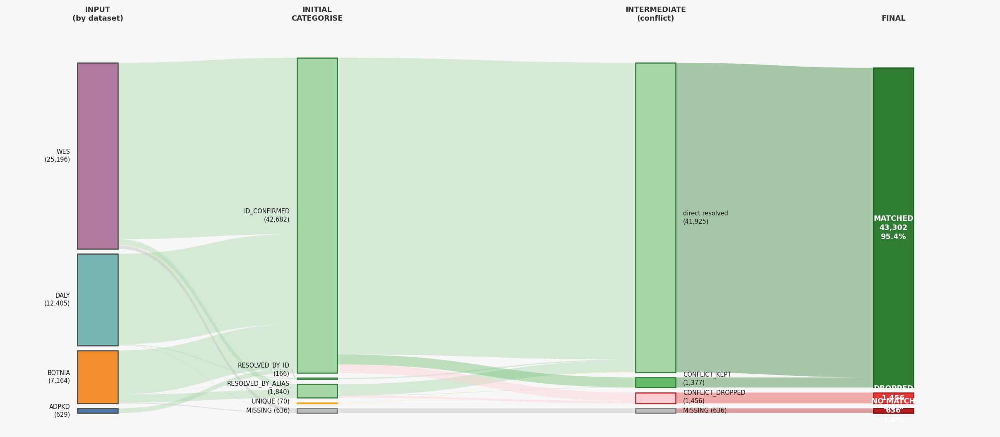

# EXOME data processing

Scripts and WDL workflows for QC-filtering and sample-matching multiple exome cohorts (BOTNIA, ADPKD, DALY, WES) against the FinnGen R14 reference panel. The primary goal is to identify which exome samples correspond to FinnGen participants, enabling downstream data integration. Sample matching uses KING --duplicate on a curated set of ~10,000 HM3 SNPs. Variant QC and genotype filtering are handled by a set of bcftools-based WDL workflows.

---

## Summary results

<!-- BEGIN:data/FG_EXOME_resolved_stats.md -->
## Mapping Totals

| GROUP | TOTAL | ADPKD | BOTNIA | DALY | WES | PCT | NOTES |
| --- | --- | --- | --- | --- | --- | --- | --- |
| MATCHED | 43302 | 619 | 7031 | 12234 | 23418 | 95.4% | samples with a final QRY→REF mapping in the output |
| DROPPED | 1456 | 10 | 22 | 118 | 1306 | 3.2% | found by KING but excluded from final mapping |
| NO MATCH | 636 | 0 | 111 | 53 | 472 | 1.4% | absent from ref or below KING concordance threshold |
| TOTAL | 45394 | 629 | 7164 | 12405 | 25196 | 100.0% |  |

## Mapping Breakdown

| GROUP | STATUS | TOTAL | ADPKD | BOTNIA | DALY | WES | PCT | NOTES |
| --- | --- | --- | --- | --- | --- | --- | --- | --- |
| MATCHED | ID_CONFIRMED | 40178 | 601 | 5937 | 11816 | 21824 | 88.5% | single candidate; KING match confirmed by matching IDs |
| MATCHED | RESOLVED_BY_ID | 160 | 6 | 31 | 102 | 21 | 0.4% | twins in ref; query ID matched one candidate |
| MATCHED | RESOLVED_BY_ALIAS | 1523 | 0 | 1054 | 0 | 469 | 3.4% | twins in ref; candidates are known aliases of each other |
| MATCHED | UNIQUE | 64 | 0 | 2 | 11 | 51 | 0.1% | single candidate; matched by genetics only |
| MATCHED | CONFLICT_KEPT | 1377 | 12 | 7 | 305 | 1053 | 3.0% | contested ref ID; kept after priority tiebreak; 1377 ref IDs contested, avg 31.4 queries/ref |
| DROPPED | CONFLICT_DROPPED | 1456 | 10 | 22 | 118 | 1306 | 3.2% | contested ref ID; lost tiebreak; REF_MAPPED = NA |
| NO MATCH | MISSING | 636 | 0 | 111 | 53 | 472 | 1.4% | no KING match found |
<!-- END:data/FG_EXOME_resolved_stats.md -->

### Mapping flowchart




## SAMPLE MATCHING

Sample matching identifies which exome samples correspond to samples in the FinnGen plink reference panel using KING kinship (`exome_duplicates.wdl`), followed by post-processing with `scripts/resolve_mapping.py` to produce a clean final mapping.

### exome_duplicates.wdl

KING-based duplicate detection between exome VCFs and the FinnGen plink reference. Preferred over gtcheck when sample counts are large — KING scales better and gives a cleaner kinship coefficient rather than a discordance rate.

**How the workflow works:**

```
MakeRegionSnplists
      │
      └─ FilterVCF ×(n_vcfs × n_regions)   [parallel scatter]
             │
       ConcatVCF                            [per VCF]
             │
       SubsetQuery (VCF → plink, shared HM3 variants)
             │
        ┌────┴────────────────┐
   SubsetRef              FilterSNPs
   (ref plink →           (QC filter query plink,
    shared variants)       build final SNP list)
        │                      │
        └────────┬─────────────┘
            PrepQuery / PrepRef
            (subset to QC snplist, het-filter,
             tag IDs, split into chunks)
                   │
              KingShards
              (KING --duplicate, all chunk pairs)
                   │
            SummarizeKing
            (per-sample duplicate summary)
                   │
             GatherResults
             (combine summaries, plots, global stats,
              resolve ambiguities, final mapping + stats)
```

**Step-by-step:**

1. **MakeRegionSnplists**: Downloads Berisa LD blocks (or takes a user-supplied file), assigns HM3 SNPs to blocks, and greedily merges blocks into `n_regions` roughly equal-sized regions. Outputs one SNP list per region (zero-padded filenames so glob order is numeric).

2. **FilterVCF** *(scatter over all VCF × region combinations)*: For each region, runs `bcftools view -R/-T` against the remote GCS VCF using a tabix pre-filter for speed. Outputs one small `vcf.gz` per shard.

3. **ConcatVCF** *(per VCF)*: Sorts the shard VCFs by region index (extracted from filename, not shard order), concatenates with `bcftools concat`, and indexes the result. The `.tbi` is a declared output so it is cached and available for downstream tasks.

4. **SubsetQuery**: Converts the concatenated VCF to plink1 binary (`--make-bed`) extracting only variants present in the HM3 bim. Handles VCF input by detecting the `.vcf.gz` extension — no `input_type` flag needed.

5. **SubsetRef** *(runs in parallel with FilterSNPs)*: Subsets the reference plink to the same shared variants, using the query bim as the SNP list (the task normalises bim → ID column automatically).

6. **FilterSNPs** *(runs in parallel with SubsetRef)*: Applies QC filters to the query plink (`--geno`, `--hwe`, `--maf`). High-quality variants go to the top of the list; the remaining variants are shuffled and appended below. `head -n target_snps | sort -V` then takes the top N sorted by genomic position. Outputs both the final SNP list and the HQ-only list for parameter inspection.

7. **PrepQuery / PrepRef**: Subsets each plink dataset to the final SNP list, removes samples with inbreeding coefficient F > `max_het_F`, annotates IIDs with a dataset prefix (`PREFIX_SAMPLEID`) so KING can distinguish query from ref samples, and splits into chunks of `chunk_size` samples for parallel KING. Note: only IID is prefixed, not FID — the prefix is used internally and stripped back when building the summary.

8. **KingShards**: Runs `king --duplicate` across all query-chunk × ref-chunk pairs sequentially within the task. Filters the `.con` output to only cross-dataset pairs (one sample has the query prefix on IID, the other does not), merges, and gzips the result.

9. **SummarizeKing**: Uses FID (never prefixed) to join the merged `.con.gz` against the query `.fam`, producing a per-sample TSV: each row is one query sample with a comma-separated list of matching reference FIDs, or `MISSING` if none found. Also generates a concordance diagnostic PNG (concordance distribution, IBS0 vs concordance scatter, SNP count per pair).

10. **GatherResults** *(always runs, even if some datasets fail)*: Collects all per-dataset summaries, adds a `DATASET` column (query prefix only), and concatenates into an intermediate `{plink_prefix}_EXOME_summary.tsv`. Stacks concordance PNGs into `{plink_prefix}_EXOME_concordance.png`. Then runs the resolve_mapping logic — with optional alias file for twin disambiguation — to produce `{plink_prefix}_EXOME_resolved.tsv`, `_stats.tsv`, and `_stats.md`.

**Inputs:**

```json
{
  "exome_duplicates.vcf_pairs":    [["ADPKD", "gs://bucket/adpkd.vcf.gz"]],
  "exome_duplicates.plink_bed":    "gs://bucket/finngen_R14_hm3.bed",
  "exome_duplicates.plink_prefix": "FG",
  "exome_duplicates.aliases":      "gs://bucket/finngen_R14_duplicate_list.txt",
  "exome_duplicates.n_regions":    100,
  "exome_duplicates.target_snps":  10000,
  "exome_duplicates.max_het_F":    0.3,
  "exome_duplicates.chunk_size":   10000
}
```

`berisa_blocks` and `aliases` are optional. If `aliases` is omitted, alias-based resolution is skipped. The Berisa LD block file is downloaded automatically if not supplied.

**Outputs:**

- `subset_vcfs[]` / `subset_tbis[]`: Concatenated HM3-subset VCF + index per input dataset (cached for reuse)
- `snplists[]`: Final SNP list used for KING (HQ variants + random padding, sorted by position)
- `hq_snplists[]`: HQ-only SNP list before padding — inspect to tune QC thresholds
- `duplicates_con[]`: Gzipped KING `.con` file with all cross-dataset duplicate pairs
- `summary[]`: Per-sample TSV — one query sample per row, matched reference IDs or `MISSING`
- `concordance_plots[]`: Per-dataset concordance diagnostic PNGs
- `excluded_samples_query[]` / `excluded_samples_ref[]`: Het-outlier samples removed before KING
- `combined_plot`: `{plink_prefix}_EXOME_concordance.png` — all concordance PNGs stacked
- `resolved_mapping`: `{plink_prefix}_EXOME_resolved.tsv` — final QRY→REF mapping with columns `QUERY`, `REF_MAPPED`, `DATASET`, `STATUS`, `CANDIDATES`, `ALIAS_NOTE`
- `resolved_stats_tsv`: `{plink_prefix}_EXOME_resolved_stats.tsv` — group totals + per-status breakdown with per-dataset counts
- `resolved_stats_md`: `{plink_prefix}_EXOME_resolved_stats.md` — same stats in Markdown, ready to paste into this README

---

### Resolve mapping logic

Runs inside `GatherResults` on `combined_summary.tsv`. Also available standalone via `scripts/resolve_mapping.py` for local re-runs without re-executing the full WDL.

```bash
python scripts/resolve_mapping.py combined_summary.tsv [--out my_mapping.tsv] [--seed 42]
```

Handles two real-world complications: twins in the reference (one query matches multiple ref candidates) and true duplicates within a query cohort (multiple queries match the same ref ID).

**Two passes:**

1. **Categorise** — each row classified independently:
   - Single candidate, IDs match → `ID_CONFIRMED` (genetic + ID agreement, strongest evidence)
   - Single candidate, IDs differ → `UNIQUE` (genetics only, the normal case)
   - Multiple candidates, query ID is one of them → `RESOLVED_BY_ID` (twins in ref; ID identifies the right one)
   - Multiple candidates, query is a known alias of one candidate → `RESOLVED_BY_ALIAS`
   - Multiple candidates, no resolution → `AMBIGUOUS_UNRESOLVED`

2. **Surjectivity check** — each REF ID must appear at most once in the final mapping. Conflicts (multiple queries claiming the same ref) are broken by random draw for now (`CONFLICT_KEPT[orig]` / `CONFLICT_DROPPED[orig]`). TODO: replace with QC tiebreaker (concordance score, het-F, n_snps).

**Output groups:**

| Group | Statuses | Meaning |
|-------|----------|---------|
| **MATCHED** | `ID_CONFIRMED`, `RESOLVED_BY_ID`, `RESOLVED_BY_ALIAS`, `UNIQUE`, `CONFLICT_KEPT[...]` | Has a final QRY→REF mapping in the output |
| **DROPPED** | `CONFLICT_DROPPED[...]`, `AMBIGUOUS_UNRESOLVED` | Found by KING but excluded from final mapping |
| **NO MATCH** | `MISSING` | No KING match found |

**Alias handling** — an optional tab-delimited file maps QRY IDs that are known aliases of REF IDs (one alias group per line, REF ID first). This is used solely to resolve QRY-side ambiguity: only the query is looked up in the alias file; REF candidates are treated as ground truth and never cross-referenced. A query in the alias file whose single candidate is listed as its alias → `RESOLVED_BY_ALIAS`; a query with multiple candidates where exactly one is in the query's alias group → also `RESOLVED_BY_ALIAS`. Alias IDs cannot appear in `REF_MAPPED`; a post-processing check enforces this.

**Test mode** — a self-contained test dataset covering every status category can be run without any input files:

```bash
python scripts/resolve_mapping.py --test
```

The tables below show the built-in input, alias groups, resolved mapping, and check results (auto-updated by `scripts/resolve_mapping.py --test`):

<!-- BEGIN:test/output.md -->
### Input

| DATASET | QUERY | DUPLICATES |
| --- | --- | --- |
| ds1 | REF001 | REF001 |
| ds1 | QRY001 | REF002 |
| ds1 | QRY_ALIAS | REF_ALIAS_A |
| ds1 | REF_T1 | REF_T1,REF_T2 |
| ds1 | QRY_T_ALIAS | REF_T2,REF_T3 |
| ds2 | QRY003 | REF003,REF004 |
| ds2 | QRY004 | REF003 |
| ds2 | QRY005 | REF005,REF006 |
| ds2 | QRY006 | REF005 |
| ds2 | QRY007 | REF006 |
| ds2 | QRY008 | MISSING |
| ds2 | QRY009 | REF007 |
| ds2 | QRY010 | REF007 |
| ds2 | QRY011 | REF008,REF009 |

### Aliases

| Group |
| --- |
| `QRY_ALIAS` ↔ `REF_ALIAS_A` |
| `QRY_T_ALIAS` ↔ `REF_T2` |

### Output

| DATASET | QUERY | DUPLICATES | REF_MAPPED | STATUS | ALIAS_NOTE |
| --- | --- | --- | --- | --- | --- |
| ds1 | REF001 | REF001 | REF001 | ID_CONFIRMED | — |
| ds1 | QRY001 | REF002 | REF002 | UNIQUE | — |
| ds1 | QRY_ALIAS | REF_ALIAS_A | REF_ALIAS_A | RESOLVED_BY_ALIAS | — |
| ds1 | REF_T1 | REF_T1,REF_T2 | REF_T1 | RESOLVED_BY_ID | — |
| ds1 | QRY_T_ALIAS | REF_T2,REF_T3 | REF_T2 | RESOLVED_BY_ALIAS | — |
| ds2 | QRY003 | REF003,REF004 | AMBIGUOUS | AMBIGUOUS_UNRESOLVED | query_not_in_alias_file |
| ds2 | QRY004 | REF003 | REF003 | UNIQUE | — |
| ds2 | QRY005 | REF005,REF006 | AMBIGUOUS | AMBIGUOUS_UNRESOLVED | query_not_in_alias_file |
| ds2 | QRY006 | REF005 | REF005 | UNIQUE | — |
| ds2 | QRY007 | REF006 | REF006 | UNIQUE | — |
| ds2 | QRY008 | MISSING | NA | MISSING | — |
| ds2 | QRY009 | REF007 | REF007 | CONFLICT_KEPT[UNIQUE] | — |
| ds2 | QRY010 | REF007 | NA | CONFLICT_DROPPED[UNIQUE] | — |
| ds2 | QRY011 | REF008,REF009 | AMBIGUOUS | AMBIGUOUS_UNRESOLVED | query_not_in_alias_file |

### Checks

| QUERY | STATUS | REF_MAPPED |  |
| --- | --- | --- | --- |
| REF001 | ID_CONFIRMED | REF001 | ✓ |
| QRY001 | UNIQUE | REF002 | ✓ |
| QRY_ALIAS | RESOLVED_BY_ALIAS | REF_ALIAS_A | ✓ |
| REF_T1 | RESOLVED_BY_ID | REF_T1 | ✓ |
| QRY_T_ALIAS | RESOLVED_BY_ALIAS | REF_T2 | ✓ |
| QRY003 | AMBIGUOUS_UNRESOLVED | AMBIGUOUS | ✓ |
| QRY004 | UNIQUE | REF003 | ✓ |
| QRY005 | AMBIGUOUS_UNRESOLVED | AMBIGUOUS | ✓ |
| QRY006 | UNIQUE | REF005 | ✓ |
| QRY007 | UNIQUE | REF006 | ✓ |
| QRY008 | MISSING | NA | ✓ |
| QRY011 | AMBIGUOUS_UNRESOLVED | AMBIGUOUS | ✓ |
| QRY009+QRY010 | 1×CONFLICT_KEPT + 1×CONFLICT_DROPPED | — | ✓ |

**13/13 checks — all passed**
<!-- END:test/output.md -->


## Annotation/QC

This section summarizes the datasets and processing steps required to merge them into a single quality-controlled dataset.

### Datasets

#### Daly Data
- **Samples**: 12,405 samples with non-FG IDs
- **Status**: Merged into a single file by Lea
- **Issues**: Required re-heading due to header formatting problems
- **QC Approach**: Contains FILTER entries allowing quick filtering with `FILTER~"NO_HQ_GENOTYPES"`
- **Notes**: [GATK GVS filter explanations](https://github.com/broadinstitute/gatk/blob/ah_var_store/scripts/variantstore/beta_docs/gvs-outputs.md#applying-the-gvs-joint-calling-filters)

#### ADPKD
- **Samples**: 629 samples with FG IDs
- **Status**: Merged by Lea and released to red sandbox
- **Issues**: Required re-heading (bcftools warnings): `[W::bcf_hdr_check_sanity] PL should be declared as Number=G`'. 
- **QC Approach**: Contains AC, DP, and GQ fields for standard filtering
- **Sample Matching**:

| Match Type | Count |
|------------|-------|
| Direct matches | 629 |
| Indirect matches via mapping | 0 |
| No match | 1 |

#### BOTNIA
- **Samples**: 7,164 samples with FG IDs
- **Status**: Single file, ready for processing
- **QC Approach**: Contains AC, DP, and GQ fields for standard filtering
- **Sample Matching**:

| Match Type | Count |
|------------|-------|
| Direct matches | 5,973 |
| Indirect matches via mapping | 1,081 |
| No match | 110 |


#### FINNGEN-WES
25201 with FGID (Sometimes with "_dup") extension to indicate duplicate. In that case there are only 23223 unique IDs left

- **Samples**:25201 with FGID (Sometimes with "_dup") extension to indicate duplicate. In that case there are only 23223 left
- **Status**: Chrom files
- **Issues** Chrom files are *massive* and mostly empty.
- **QC Approach**: Contains AC, DP, and GQ fields for standard filtering
- **Sample Matching**:

| Match Type | Count |
|------------|-------|
| Direct matches | 22163 unique |
| Indirect matches via mapping | 730 |
| No match | 330 |


### WDL Workflows

This repository contains WDL (Workflow Description Language) workflows for processing VCF files from sequencing data. All workflows are located in the `wdl/` directory.

#### Overview

| Workflow | Purpose | Input Data Type |
|----------|---------|-----------------|
| `wes_chrom.wdl` | **Multi-chromosome parallel filtering** | Per-chromosome VCFs (exome or targeted sequencing) |
| `single_file_qc.wdl` | **Whole genome filtering** | Single whole-genome VCF files (splits by chromosome internally) |
| `daly_qc.wdl` | **Simple filter-based QC** | Any VCF with FILTER flags to remove |

---

#### wes_chrom.wdl

**Parallel filtering workflow for per-chromosome WES data with position-based chunking**

**What it does:**

1. Optionally subsets samples for testing (if `test_sample_count` is provided)
2. Computes statistics on original VCFs (variant counts per chromosome)
3. Pre-filters each VCF (`PreFilter` task):
   - Removes AC=0 variants (monomorphic sites)
   - Annotates variant IDs as `CHROM_POS_REF_ALT`
4. Parallel filters by region using position-based chunking:
   - Splits each chromosome into equal chunks by variant positions
   - **Splits multiallelics** (`bcftools norm -m -any`) and **normalises against reference FASTA** (`bcftools norm -c x`) — done first before any other filters
   - Applies genotype filters (sets low-quality genotypes to missing)
   - Recalculates AC (allele count) after genotype filtering
   - Applies variant filters (removes variants with AC=0, etc.)
5. Validates filtering on sample VCFs (checks filters worked correctly)
6. Creates summary statistics showing variant counts and drop rates per chromosome

**Key features:**

- **Uses both `-r` and `-T` flags**: Fast index-based seeking (`-r`) combined with exact position filtering (`-T`) to avoid overlapping variants between chunks
- **No sorting needed**: Position-based chunking ensures chunks don't overlap, so naive concatenation produces sorted output
- **Extensive validation**: Creates sample VCFs and validates that filters were applied correctly

**Inputs:**

```json
{
  "vcf_list": "path/to/vcf_list.txt",
  "genotype_filter": "FORMAT/DP<10 | FORMAT/GQ<20",
  "variant_filter": "AC>0 & ALT!=\"*\"",
  "cpu_count": 16,
  "norm_fasta": "gs://bucket/reference.fa",
  "test_sample_count": 10  // Optional: subset to first N samples for testing
}
```

Input file format (`vcf_list.txt`):
```
gs://bucket/chr1.vcf.gz
gs://bucket/chr2.vcf.gz
gs://bucket/chr3.vcf.gz
...
```

**Outputs:**

- `filtered_vcfs[]`: Per-chromosome filtered VCF files
- `filtered_vcf_tbis[]`: Corresponding index files
- `merged_vcf`: All chromosomes merged into single VCF
- `merged_vcf_tbi`: Index for merged VCF
- `summary_table`: TSV with chromosome-level and total drop rates
- `original_stats[]`: Variant counts before filtering
- `filtered_stats[]`: Variant counts after filtering
- `validation_reports[]`: Per-chromosome validation reports


---

#### single_file_qc.wdl

**Per-chromosome parallel filtering for whole genome VCF files**

**What it does:**

Designed for **whole genome VCF files** where all chromosomes are in a single file. The workflow automatically splits processing by chromosome for parallelization.

1. Optionally subsets samples for testing
2. Computes chromosome counts for original VCF
3. Filters each chromosome in parallel:
   - **Auto-detects chromosome naming** — if the VCF uses non-prefixed names (`1`, `22`) instead of `chr1`, `chr22`, chromosomes are permanently renamed to `chr`-prefix in the output so both VCF types produce consistently named output
   - Strips null bytes (`tr -d '\0'`) to handle corrupt FORMAT fields
   - **Splits multiallelics** (`bcftools norm -m -any`) and **normalises against reference FASTA** (`bcftools norm -c x`)
   - Sets low-quality genotypes to missing
   - Recalculates AC
   - Filters variants by expression
   - Annotates variant IDs as `CHROM_POS_REF_ALT`
4. Validates filtering worked correctly
5. Outputs filtered VCF files

**Key differences from wes_chrom.wdl:**

- Processes **whole genome files** (not pre-split by chromosome)
- Uses **chromosome-based parallelization** instead of position chunking
- Works with both **chr-prefixed** (e.g. ADPKD) and **non-prefixed** (e.g. BOTNIA) VCFs — output is always chr-prefixed
- No merging step (outputs remain per-chromosome)
- Simpler workflow for whole genome data

**Inputs:**

```json
{
  "vcf_files": ["gs://bucket/whole_genome.vcf.gz"],
  "genotype_filter": "FORMAT/DP<10 | FORMAT/GQ<20",
  "variant_filter": "AC>0 & ALT!=\"*\"",
  "cpu_count": 8,
  "norm_fasta": "gs://bucket/reference.fa",
  "test_sample_count": 10  // Optional
}
```

**Outputs:**

- `filtered_vcfs[]`: Filtered VCF per input file
- `filtered_vcf_tbis[]`: Index files
- `original_chrom_counts[]`: Variant counts per chromosome (before)
- `filtered_chrom_counts[]`: Variant counts per chromosome (after)
- `validation_reports[]`: Validation reports

**How to run:**

```bash
cat > inputs.json << EOF
{
  "single_file_qc.vcf_files": ["gs://bucket/whole_genome.vcf.gz"],
  "single_file_qc.genotype_filter": "FORMAT/DP<10 | FORMAT/GQ<20",
  "single_file_qc.variant_filter": "AC>0 & ALT!=\\\"*\\\"",
  "single_file_qc.cpu_count": 8
}
EOF

java -jar cromwell.jar run wdl/single_file_qc.wdl -i inputs.json
```

---

#### daly_qc.wdl

**FILTER-based QC with header annotation and sample renaming**

**What it does:**

For each input VCF (scatter over vcf_list):

1. **ComputeStats**: Reads the remote index only — gets chrom, variant count, sample count without downloading the VCF.
2. **AnnotateAndRename**: Fetches the VCF header, injects any missing FILTER definitions (`NO_HQ_GENOTYPES`, `ExcessHet`, `LowQual`, `EXCESS_ALLELES`, `OUTSIDE_OF_TARGETS`), builds a `SAMPLE_ID → FINNGENID_finngen` rename map from the `rename_file`, resolves duplicate new IDs with `_dup`/`_dup2` suffixes, and applies header + rename in a single `bcftools reheader` pass (fast — body is copied verbatim).
3. **ParallelFilter**: Splits the chromosome into `cpu_count × chunk_multiplier` equal position windows, filters each chunk in parallel with GNU parallel (`bcftools view -e filter_expression`), annotates variant IDs as `CHROM_POS_REF_ALT`, and concatenates.
4. **ComputeStats** (again): Variant counts on the filtered VCF.
5. **ValidateFiltering**: Checks no variants matching the filter expression remain, verifies `CHROM_POS_REF_ALT` ID format, and reports rename counts.

Then globally:

6. **SummaryStats**: Per-chromosome variant counts + drop rates, derives output root name from input filenames.
7. **SortAndMerge**: Concatenates per-chromosome filtered VCFs (in vcf_list order) into `{root_name}.QC_ANNOTATED.vcf.gz`.

**Inputs:**

```json
{
  "daly_qc.vcf_list":         "path/to/vcf_list.txt",
  "daly_qc.rename_file":      "path/to/rename.tsv",
  "daly_qc.filter_expression": "FILTER~'NO_HQ_GENOTYPES'",
  "daly_qc.cpu_count":        8,
  "daly_qc.vcf_max_gb":       25,
  "daly_qc.chunk_multiplier": 3
}
```

`rename_file` is a TSV with columns: `FINNGENID_finngen(1)`, `FINNGENID_biobank(2)`, `SAMPLE_ID(3)` — samples are renamed from col 3 to col 1. `filter_expression`, `vcf_max_gb`, and `chunk_multiplier` are optional.

**Outputs:**

- `original_stats[]`: Variant/sample counts before filtering (index-only, fast)
- `filtered_stats[]`: Variant counts after filtering
- `validation_reports[]`: Per-VCF filter check + rename summary
- `merged_vcf`: `{root_name}.QC_ANNOTATED.vcf.gz` — all chromosomes merged, samples renamed to FinnGen IDs
- `merged_vcf_tbi`: Index for merged VCF
- `report`: `{root_name}.QC_ANNOTATED.report.txt` — per-chromosome and total drop rates

**How to run:**

```bash
cat > inputs.json << EOF
{
  "daly_qc.vcf_list":         "vcf_files.txt",
  "daly_qc.rename_file":      "rename.tsv",
  "daly_qc.filter_expression": "FILTER~'NO_HQ_GENOTYPES'",
  "daly_qc.cpu_count":        8
}
EOF

java -jar cromwell.jar run wdl/daly_qc.wdl -i inputs.json
```

---

#### Common Patterns

**Filter Expressions**

*Genotype filters* (applied with `bcftools +setGT`):
- `FORMAT/DP<10 | FORMAT/GQ<20` - Set genotypes to missing if DP<10 OR GQ<20
- `FORMAT/DP<10 & FORMAT/GQ<20` - Set genotypes to missing if DP<10 AND GQ<20
- `FORMAT/DP<10` - Only depth filter
- `FORMAT/GQ<20` - Only quality filter

*Variant filters* (applied with `bcftools view -i`):
- `AC>0` - Keep variants with at least 1 alternate allele
- `ALT!="*"` - Remove spanning deletions
- `AC>0 & ALT!="*"` - Both conditions
- `AC>=2` - Keep variants with at least 2 alternate alleles (removes singletons)

**Testing**

All workflows support `test_sample_count` to subset samples for faster testing:

```json
{
  "test_sample_count": 10  // Only process first 10 samples
}
```

**CPU Count**

Controls parallelization level:
- `wes_chrom.wdl`: Number of chunks per chromosome
- `single_file_qc.wdl`: Number of chromosomes processed in parallel
- `daly_qc.wdl`: Number of genomic regions processed in parallel

Recommended: 8-16 for most use cases.

---

#### Troubleshooting

**"Unsorted positions" error during indexing**

*Cause:* Overlapping variants between chunks (old behavior with `-R` only)

*Solution:* Use `wes_chrom.wdl` which uses both `-r` and `-T` to ensure no overlaps

**Filter expression errors**

*Symptom:* `Error occurred while processing the filter`

*Solution:* Ensure special characters are properly escaped:
```json
"variant_filter": "AC>0 & ALT!=\"*\""  // Correct
"variant_filter": "AC>0 & ALT!=*"      // Wrong - missing quotes
```

**Out of memory errors**

*Solution:* Increase memory in runtime section or reduce `cpu_count` (fewer parallel chunks = less memory)

---

#### Requirements

- bcftools (with +setGT and +fill-tags plugins)
- tabix
- parallel (GNU parallel)
- Python 3 with numpy (for position chunking in wes_chrom.wdl)
- WDL runtime (Cromwell, miniwdl, etc.)

